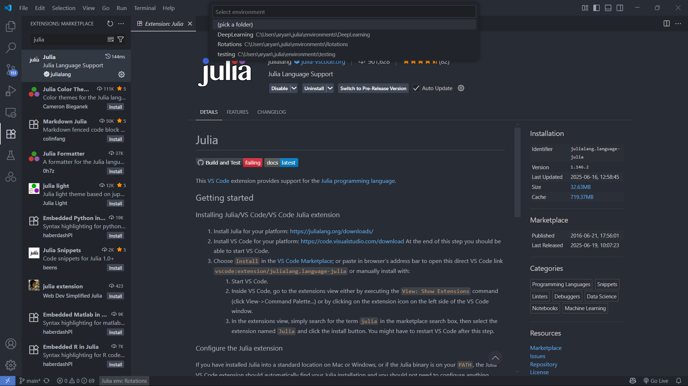

# Flapping Wing Flying Research: Quaternion Visualization & 3D Animation

This project provides interactive tools and visualizations for understanding 3D rotations, quaternions, and coordinate transformations, with a focus on applications in flapping wing flight research. It leverages [Julia](https://julialang.org/) and [Makie.jl](https://makie.juliaplots.org/stable/) for high-performance 3D graphics and animation.

Demo Video:


---

## Getting Started

To get started with the code, you need to download it to your device. You can, however, also use some features online (see [Running The Simulation Online](#running-the-simulation-online) below).

### Clone the Entire Repository

To clone the full repository using Git, run:

```bash
git clone https://github.com/AlmostAPhysicist/Flapping-Wings.git
```

This will create a local copy of the project on your computer. 

<details>
<summary>
More about Git
</summary>

Optionally, you could provide an additional argument for the folder name:
```bash
git clone https://github.com/AlmostAPhysicist/Flapping-Wings.git MyRootFolder
```
This will clone the repository into a folder named `MyRootFolder` instead of the default.

To update your local copy with the latest changes from the online repository, use:
```bash
git pull
```
Run this command inside your project folder to fetch and merge any updates.

Alternatively, you can use the following two-step process:
```bash
git fetch
git merge
```
- `git fetch` downloads the latest changes from the remote repository but does **not** modify your working files.
- `git merge` applies those fetched changes to your local branch.

`git pull` is essentially a shortcut that combines `git fetch` and `git merge` in one step. Using `fetch` and `merge` separately gives you more control, for example, to review changes before merging.

(Be sure to resolve conflicts correctly if you make any changes to your local files)

For more information on git, Refer to:
- [GitHub Documentation](https://docs.github.com/en/get-started/git-basics)
- [Recommended Youtube Tutorial on Git and GitHub](https://youtu.be/K6Q31YkorUE?si=f-pDlVyrMisFwk-v)
</details>

You can also simply download the Zip file from under the Code (a green tab) on the repository page (under the Local tab)

### Download a Specific Folder

If you only need a particular folder (such as `Notes`), you can use [download-directory.github.io](https://download-directory.github.io/):

<details>

1. Go to [https://download-directory.github.io/](https://download-directory.github.io/)
2. Paste the URL of the folder you want to download, for example:  
   `https://github.com/AlmostAPhysicist/Flapping-Wings/tree/main/Notes`
3. Download the generated ZIP file and extract it on your device.

</details>

---

## Quick Start

If you have [Julia Programming Language](https://julialang.org/) Installed and are setup with all the dependencies:

<details>

<summary>
Click Here if You have everything setup
</summary>

 Run the main visualization:
```julia
julia --project=@Rotations Simulations/dragonfly.jl
```

This will open an interactive 3D dragonfly simulation where you can control wing movements and observe how quaternions handle complex 3D rotations!

</details>


If you're wondering **"What is Julia?"**, and/or have not setup the dependencies check out the documentation below for an introduction.

---

## Project Structure

```
Flapping Wing Flying Research/
├── src/                     # Core functionality modules             
├── Simulations/             # Main simulation files
│   └── dragonfly.jl             # *Interactive dragonfly wing simulation*
├── Demos-and-Tutorials/     # Learning materials and examples                 
├── Models/                  # 3D model files (.stl, .obj)                
├── Media/                   # Generated images and videos                
├── Plots/                   # Generated analysis plots
└── Notes/                   # Documentation and research papers
```

## Setup and Introduction to Julia
>Julia is a high-level, general-purpose dynamic programming language, designed to be fast and productive, for e.g. data science, artificial intelligence, machine learning, modeling and simulation, most commonly used for numerical analysis and computational science.

### Step 1: Install Julia

First, you need to install Julia on your computer:

You can look at the OS Specific installation instructions for Julia.

For Windows, I recommend installing it from the Microsoft Store that installs Julia and JuliaUp (the version manager).

A more ubiquitous/manual way to download it is: 

1. Go to [https://julialang.org/downloads/](https://julialang.org/downloads/)
2. Download Julia for your operating system (Windows, macOS, or Linux)
3. Follow the installation instructions for your platform

<details>
<summary> Detailed Julia Installation Instructions</summary>

**For Windows:**
1. Download the Windows installer (.exe file)
2. Run the installer and follow the setup wizard
3. Make sure to check "Add Julia to PATH" during installation
4. Open Command Prompt or PowerShell and type `julia` to verify installation

**For macOS:**
1. Download the macOS installer (.dmg file)
2. Open the .dmg file and drag Julia to your Applications folder
3. Open Terminal and add Julia to your PATH by adding this line to your `~/.bash_profile` or `~/.zshrc`:
   ```bash
   export PATH="/Applications/Julia-1.x.app/Contents/Resources/julia/bin:$PATH"
   ```
4. Restart Terminal and type `julia` to verify installation

**For Linux:**
1. Download the Linux tarball (.tar.gz file)
2. Extract it to a directory like `/opt/julia`
3. Add Julia to your PATH in your `~/.bashrc` or `~/.profile`:
   ```bash
   export PATH="/opt/julia/bin:$PATH"
   ```
4. Restart your terminal and type `julia` to verify installation

</details>

### Step 2: Set Up Julia Environment

Now we'll create a dedicated environment for this project with all the necessary packages.

#### Opening Julia REPL

1. Open your terminal (Command Prompt on Windows, Terminal on macOS/Linux)
2. Type `julia` and press Enter
3. You should see the Julia welcome message and the `julia>` prompt

#### Creating and Activating the Environment

1. **Enter Package Manager Mode**: In the Julia REPL, type `]` (right square bracket)
   - Your prompt should change from `julia>` to `pkg>`
   - This means you're now in the package manager

2. **Create and Activate Environment**: Type the following command:
   ```julia
   activate @Rotations
   ```
   
   <details>
   <summary>What does @Rotations mean?</summary>
   
   The `@` symbol represents a **shared environment**. This is equivalent to running:
   ```julia
   activate --shared Rotations
   ```
   
   **Why use a shared environment?**
   - You can use the same packages across any project
   - Avoids downloading packages multiple times
   - Makes it easier to maintain consistent package versions
   - More convenient for learning and experimentation
   
   </details>

3. **Verify Environment Activation**: You should now see:
   ```
   (@Rotations) pkg>
   ```
   This confirms you've successfully created and activated the environment.

#### Adding Required Packages

While still in package manager mode (you should see `(@Rotations) pkg>`), run:

```julia
add BenchmarkTools, Colors, DataStructures, FileIO, GLMakie, GeometryBasics, Quaternions
```

Press Enter and wait for the packages to install. **This will take several minutes** as these are substantial packages with many dependencies.

<details>
<summary> What each package does</summary>

- **BenchmarkTools**: Performance measurement and optimization
- **Colors**: Color manipulation and palettes for visualizations
- **DataStructures**: Advanced data structures (queues, stacks, etc.)
- **FileIO**: Reading and writing various file formats (.stl, .obj, etc.)
- **GLMakie**: High-performance 3D graphics and interactive plotting
- **GeometryBasics**: 3D geometry primitives (points, vectors, meshes)
- **Quaternions**: Quaternion mathematics for 3D rotations

</details>

<details>
<summary> Alternative Package Installation Method</summary>

Instead of using the package manager mode, you can also install packages from the normal Julia REPL:

1. Make sure you're in normal mode (`julia>` prompt, not `pkg>`)
2. Run this code:
   ```julia
   using Pkg
   Pkg.add(["BenchmarkTools", "Colors", "DataStructures", "FileIO", "GLMakie", "GeometryBasics", "Quaternions"])
   ```

Both methods achieve the same result.

</details>

#### Exiting Package Manager and Testing Installation

1. **Exit Package Manager**: Press `Backspace` to return to the normal Julia REPL (`julia>` prompt)

2. **Test Package Loading**: Try loading one of the packages:
   ```julia
   using Quaternions
   ```
   
   **Note**: The first time you load packages (especially GLMakie), it will take a while to precompile. GLMakie can take several minutes on the first run, but subsequent loads will be much faster (under a minute).

> To Learn More About Julia, refer to the Documentation: 
> [Julia Documentation](https://docs.julialang.org/)

---

## Development Environment Setup

### Using VS Code (Recommended)

VS Code provides the best development experience for Julia:

1. **Install VS Code**: Download from [https://code.visualstudio.com/](https://code.visualstudio.com/)

2. **Install Julia Extension**: 
   - Open VS Code
   - Go to Extensions (Ctrl/Cmd + Shift + X)
   - Search for "Julia" and install the official Julia extension

3. **Set Environment in VS Code**:
   - Look at the bottom-left corner of VS Code
   - You should see "Julia env: *environment_name*"
   - Click on it and select your `@Rotations` environment
   - **Important**: Close any existing Julia terminals in VS Code after switching environments

<details>
<summary>Reference Image</summary>



</details>

<details>
<summary>VS Code Julia Extension Features</summary>

The Julia extension provides:
- Syntax highlighting and code completion
- Integrated REPL within VS Code
- Debugging capabilities
- Plot pane for visualizations
- Package management interface
- Integrated help and documentation

</details>

### Running Files from Command Line 

If you prefer working from the terminal, you can run Julia files directly:

<details>

```bash
julia --project=@Rotations your_file.jl
```

For example, to run the main dragonfly simulation:
```bash
julia --project=@Rotations Simulations/dragonfly.jl
```

<details>
<summary>Command Line Options Explained</summary>

- `julia`: Starts the Julia interpreter
- `--project=@Rotations`: Tells Julia to use the @Rotations environment
- `your_file.jl`: The Julia file you want to run

You can also use other useful options:
- `--threads=auto`: Use all available CPU cores
- `--optimize=2`: Enable optimizations (default)
- `--startup-file=no`: Skip loading startup file for faster startup

</details>
</details>

### Running The Simulation Online
[JuliaHub](https://juliahub.com/) is currently one of the best ways to collaborate on Julia projects online. 

You may also use [Google Colab](https://colab.research.google.com/) or [Codespaces](https://github.com/features/codespaces) to collaborate.

To run the simulation on JuliaHub (i.e. online, on a browser without having to download Julia on your device):

<details>

- go to [JuliaHub](https://juliahub.com/)
- create an account
- create a new Project
- click on Import
- paste the link to the GitHub repo (eg: "https://github.com/AlmostAPhysicist/Flapping-Wings")
- Create a Launch the Project
- Run the webdemo (see instructions... you must change all imports from GLMakie to WGLMakie in the source files)

**Note however that the web version is not as powerful since it does not use OpenGL backends, instead, WebGL. Therefore, the interactivity and functionality of the web version is restrictive. I thus recommend installing Julia on your device.**

</details>

---

## Running the Main Simulation

Once your environment is set up, you can run the interactive dragonfly simulation:

In VSCode, just click on the `Simulations/dragonfly.jl` file to open and click on the `run` button from VSCode (The sideways triangle on the top right **▷**). The terminal (`Ctrl+J` if you want to toggle it on/off) would show you the progress of the simulation loading.


Alternatively, I also like to run specific code blocks one at a time by selecting them and then pressing `Shift+Enter`
.

<details>
<summary>
Running the simulation from the command line
</summary>

1. **Navigate to Project Directory**:
   ```bash
   cd "d:\Programming\Flapping Wing Flying Research"
   ```

2. **Run the Simulation**:
   ```bash
   julia --project=@Rotations Simulations/dragonfly.jl
   ```

3. **What to Expect**:
   - The program will print loading messages
   - A 3D window will open showing a dragonfly model
   - You can interact with controls to adjust wing movements
   - Real-time visualization of quaternion-based rotations

<details>
<summary>Simulation Controls and Features</summary>

The dragonfly simulation includes:
- **Interactive Controls**: Sliders and buttons to control wing parameters
- **Real-time Animation**: Watch wings flap with realistic motion
- **Quaternion Visualization**: See how rotations are represented mathematically
- **Recording Capability**: Save animations as video files
- **Multiple Views**: Switch between different camera angles
- **Performance Monitoring**: Real-time FPS and computation metrics

</details>
</details>

---

## Learning Materials

### For Beginners

- [Trailer - Getting Started with Julia](https://youtu.be/eDtVDMjZ6Nc?si=_05001SSMhXEMB7e)
- [Julia Syntax for Programmers](https://youtu.be/Rk12jda7cV0?si=qhmGu1cLXimZWuJA)
- [Makie Basics for Plotting and Dynamic/Interactive Programming](https://youtu.be/L-gyDvhjzGQ?si=-0RiwxUo82yBB1g7)
- [Scientific Computing in Julia (In case you want to dive deep)](https://youtube.com/playlist?list=PLhQ2JMBcfAsjQzwp2j97uZjNOMi7Ed4CG&si=J3HDF37AWJsY_Y_N)


I have a few demo files of my own that you may find useful:

1. `Demos-and-Tutorials/quaternion_demo.jl`: Basic quaternion operations
2. `Demos-and-Tutorials/rotation-demo.ipynb`: Interactive Jupyter notebook
3. `Demos-and-Tutorials/MakieTutorial.ipynb`: Learn 3D plotting

### Understanding the Code Structure

<details>
<summary>Core Module Overview</summary>

**State_and_Conversions.jl**:
- Defines the `State` struct for representing 3D orientations
- Converts between quaternions, rotation matrices, and Euler angles
- Provides constructors for different input formats

**Rendering.jl**:
- Functions for drawing 3D objects and coordinate frames
- Utilities for creating arrows, meshes, and visual elements
- Color and styling management

**Transformations.jl**:
- Mathematical operations for 3D transformations
- Quaternion interpolation (SLERP - Spherical Linear Interpolation)
- Coordinate system conversions

**WindowManager.jl**:
- Manages multiple 3D windows and scenes
- Handles window layout and synchronization
- Provides utilities for multi-view displays

**Recorder.jl**:
- Video recording and animation export
- Frame capture and processing
- File format management

</details>

### The Mathamatics Behind the Code
Refer to `Notes` for all the Mathematics and ideas.
It consists of an [Obsidian](https://obsidian.md/) vault with my Notes (which you can open in Obsidian and annotate, edit, etc.) as well as a PDF folder which contains the PDF version for all the notes in case you do not have Obsidian.

--- 

## Research Applications

This project is designed for research in:

- **Flapping Wing Aerodynamics**: Understanding complex wing motions
- **Quaternion Mathematics**: Visualizing 4D rotation representations
- **3D Animation**: Creating scientific visualizations
- **Flight Dynamics**: Modeling insect and bird flight patterns

<details>
<summary>Scientific Background</summary>

**Why Quaternions for Flight Research?**

Quaternions are superior to Euler angles for flight simulation because they:
- Avoid gimbal lock problems
- Provide smooth interpolation between orientations
- Require less computational resources
- Represent rotations more naturally

**Flapping Wing Flight Mechanics:**

Insect flight involves complex 3D motions:
- **Stroke Plane**: The plane in which wings move
- **Angle of Attack**: Wing's orientation relative to airflow
- **Rotation**: Wing twist during the stroke cycle
- **Phase Relationships**: Timing between left and right wings

</details>

---

## Advanced Usage

### Recording Animations

<details>
<summary>
Code
</summary>

```julia
# Import Functions
using GLMakie: Scene, meshscatter!, cam3d!
using GLMakie

# Import the recorder code
include("../src/Recorder.jl")


# Create a Figure to record
#--------------------------
s = Figure(size=(500,500), camera=cam3d!, title="Recording Test")
axes = Axis3(s[1,1],  aspect = (1, 1, 1))
meshscatter!(axes, (0, 0, 0))

# Set parameters
#---------------
framerate = 30  # Frames per second
t = Observable(0.0)
recording = Observable(true)
io_ref = Ref{Any}(nothing)
filepath = joinpath(@__DIR__, "test.mp4")

# Add Elements to the figure
#---------------------------

# Print time on bottom left corner
text!(axes, (0,0,0), text=lift(t) do time
    "Time: $(round(time/framerate, digits=2)) s"
end, color=:black, fontsize=20, space=:pixel)

# Print t value on top right corner
text!(axes, (500, 500, 0), text=lift(t) do time
    "t: $(round(time, digits=2))"
end, color=:black, fontsize=20, space=:pixel, align=(:right, :top))

# Start recording
#----------------
record_on_change_until(s.scene, t, recording, io_ref, filepath; framerate=framerate)


# Animate
#--------
for i in 1:1000
    t[] += 1
    sleep(1/framerate)  # Simulate some work
    if !recording[]
        break
    end
end
```

</details>

### Custom Wing Models

Place your .stl or .obj files in the `Models/` directory and load them:

```julia
using GLMakie, FileIO
my_wing = load("Models/my_custom_wing.stl")
```
<details>
<summary>
details on file paths
</summary>
Refer to `Demos-and-Tutorials/filepaths.jl`
</details>

### Performance Optimization

<details>
<summary>Tips for Better Performance</summary>

1. **Use Multiple Threads**:
   ```bash
   julia --project=@Rotations --threads=auto your_file.jl
   ```

2. **Precompile Packages**: Run this once to speed up future loads:
   ```julia
   using Pkg
   Pkg.precompile()
   ```

3. **Profile Your Code**:
   ```julia
   using BenchmarkTools
   @benchmark your_function()
   ```

4. **GPU Acceleration**: GLMakie automatically uses GPU when available

</details>

---

## Troubleshooting

### Common Issues

<details>
<summary>
Package not found errors
</summary>

- Make sure you're in the correct environment (`(@Rotations) pkg>`)
- Try `pkg> instantiate` to reinstall packages

</details>

<details>
<summary>
GLMakie won't display
</summary>

- Update your graphics drivers
- Try `ENV["JULIA_GL_NO_ERROR_CHECK"] = true` before loading GLMakie

</details>

<details>
<summary>
Slow first-time loading
</summary>

- This is normal for the first run
- Subsequent runs will be much faster
- Consider precompiling packages (Look at `Performance Optimization` within the documentation)

</details>

<details>
<summary>
Out of memory errors
</summary>

- Update VSCode, Julia and/or all the packages within the environment
- Restart your PC, make sure it is up to date
- Make sure your system drive (C) is not full (often, memory cache is stored here)
- Close other applications to free up memory
- Reduce model complexity or animation resolution

</details>

<details>
<summary>Advanced Troubleshooting</summary>

**Environment Issues**:
```julia
# Check current environment
using Pkg
Pkg.status()

# Reset environment if needed
pkg> rm --all
pkg> add BenchmarkTools Colors DataStructures FileIO GLMakie GeometryBasics Quaternions
```

**Graphics Issues**:
```julia
# Force software rendering if GPU fails
ENV["LIBGL_ALWAYS_SOFTWARE"] = "true"
using GLMakie
```

**Package Conflicts**:
```julia
# Update all packages
pkg> update
# Or create fresh environment
pkg> activate @RotationsNew
```

</details>

---

## Contributing

You are welcome to contribute to the project of Insect Flights (Flying Insects and Flapping Robots):

1. Fork the repository
2. Create a new branch for your feature
3. Test your changes thoroughly
4. Submit a pull request with detailed description

[Watch a Youtube Video on Forks and Pull Requests](https://www.youtube.com/watch?v=a_FLqX3vGR4)

### Development Guidelines

- Follow Julia style conventions
- Add comments explaining complex quaternion operations
- Include examples for new functions
- Test with different 3D models

## License

This project is open source. Please respect the licenses of included 3D models and external libraries.

---

## Other Learning Resources

### Quaternions and 3D Rotations
- [Orientation, Rotation, Velocity and Acceleration, and the SRM](https://www.sedris.org/wg8home/Documents/WG80485.pdf) by Paul Berner
- [3Blue1Brown Youtube Video (with a 3D interactive tool linked in the description)](https://youtu.be/zjMuIxRvygQ?si=j_nJX0ZSLYN_CF_Q) by Grant Sanderson
- [Wikipedia Page on Euler Angles](https://en.wikipedia.org/wiki/Euler_angles)
(Other sources have been linked within the `Notes` folder files)

### Julia Programming
- [Julia Documentation](https://docs.julialang.org/)
- [Doggo.jl](https://www.youtube.com/@doggodotjl/playlists) - Approachable Youtube Videos on Julia Programming Language
- [Official Julia Youtube Channel with Latest Development Updates](https://www.youtube.com/@TheJuliaLanguage)
- [Julia Discourse for all your Questions](https://discourse.julialang.org/)

### Makie.jl Visualization
- [Makie.jl Documentation](https://makie.juliaplots.org/stable/)
- [Beautiful Makie](https://beautiful.makie.org/) - Gallery of examples

---


*If you encounter any issues or have questions, don't hesitate to open an issue or ask for help. The world of 3D rotations and flapping wing flight is fascinating, and we're here to help you explore it!*


